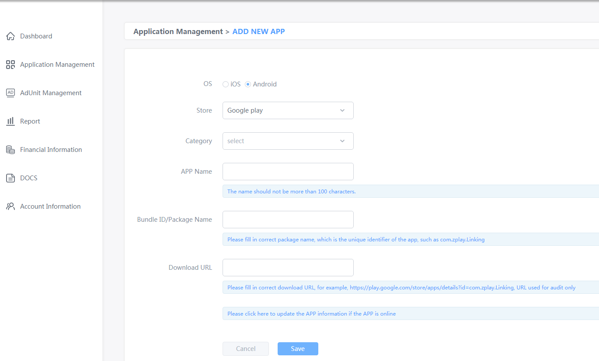

## Directory
1. Apply for APP ID and Ad Unit ID on ZPLAY Ads platform
2. Add MoPub SDK and ZPLAY Ads SDK
3. Add the following files into project
4. Set ad unit for ZPLAY Ads on MoPub
5. Add ZPLAY Ads as a new network on MoPub 
6. Turn on ZPLAY Ads network on MoPub
7. Confirm the configuration of ZPLAY Ads
8. Use MoPub to request ZPLAY Ads in project


## 1. Apply for APP ID and Ad Unit ID on ZPLAY Ads platform
### 1.1 Click *ADD NEW APP* button in [Application Management](https://sellers.zplayads.com/#/app/appList/) page


### 1.2 Fill in app information, and click *Save* button, then go back to Application Management
a. If your APP is lauched in Google Play, you can fill in package name to get APP information


b. If your APP has not lauched in Google Play, or lauched in non Google Play store, you should fill in APP information manually


### 1.3 Obtain your APP ID in Application Management page


### 1.4 Click *ADD NEW ADUNIT* button in app list, or you are also available to do this in [AdUnit Management](https://sellers.zplayads.com/#/ad/placeList/) page


### 1.5 Fill in adunit information, and click *Save* button, then go back to AdUnit Management


### 1.6 Obtain your adunit ID in AdUnit Management page


Note: You are available to use the following ID when testing(not charge). Please switch to the ID you applied in production mode.

|OS|Ad_Type|  App_ID  |  Ad_Unit_id|
|--------|---|----------|------------|
|Android|Rewarded video|5C5419C7-A2DE-88BC-A311-C3E7A646F6AF|3FBEFA05-3A8B-2122-24C7-A87D0BC9FEEC|
|Android|Interstitial|5C5419C7-A2DE-88BC-A311-C3E7A646F6AF|19393189-C4EB-3886-60B9-13B39407064E|

## 2. Add MoPub SDK and ZPLAY Ads SDK as below:
```
dependencies {
    ...
    // ZPLAY Ads dependency
    compile 'com.playableads:playableads:2.2.1'
    // Mopub dependency
    compile('com.mopub:mopub-sdk:5.4.0@aar') {
        transitive = true
    }
}
```
### 2.1 Add android project dependency


### 2.2 Add MoPub-used components in Manifest file
```
<application>
    <activity
        android:name="com.mopub.mobileads.MoPubActivity"
        android:configChanges="keyboardHidden|orientation|screenSize" />
    <activity
        android:name="com.mopub.mobileads.MraidActivity"
        android:configChanges="keyboardHidden|orientation|screenSize" />
    <activity
        android:name="com.mopub.common.MoPubBrowser"
        android:configChanges="keyboardHidden|orientation|screenSize" />
    <activity
        android:name="com.mopub.mobileads.MraidVideoPlayerActivity"
        android:configChanges="keyboardHidden|orientation|screenSize" />
    <activity
        android:name="com.mopub.mobileads.RewardedMraidActivity"
        android:configChanges="keyboardHidden|orientation|screenSize" />
</application>
```


## 3. Add the following files into project
[ZPLAYAdsRewardedVideo.java](app/src/main/java/com/zplay/playable/mediationmopub/ZPLAYAdsRewardedVideo.java)
Please ensure no errors after classes imported. Then record the path of package, e.g （com.zplay.playable.mediationmopub.ZPLAYAdsRewardedVideo）, which is used to configure ZPLAYAds on MoPub.

## 4. Set ad unit for ZPLAY Ads on [MoPub](https://app.mopub.com/apps) 
### 4.1 Create new adunit for ZPLAY Ads
- a. Choose your app, click *New ad unit* button


- b. Choose Rewarded video or Fullscreen when creating adunit, then click *Save* button, take Rewarded video as an example here

 

- c. Obtain the new adunit ID


### 4.2 Obtain the existed adunit ID
- a. Choose your APP and enter adunit list.Click the adunit, and click *Edit an unit*, then choose *View code integration* button.


- b. Obtain the adunit ID


## 5. Add ZPLAY Ads as a new network on [MoPub](https://app.mopub.com/networks)
### 5.1 Open Networks page, click *New network* button


### 5.2 Click *Custom SDK Network* link


### 5.3 Set the title as ZPLAY Ads Network, and configure ZPLAY Ads in the adunits which were applied in step 3(image 1 and 2).


- a. Add the followings to image 1:
```
com.zplay.playable.mediationmopub.ZPLAYAdsRewardedVideo
```

(Note:Please fill in the existed position of ZPLAYAdsRewardedVideo in project.)

- b. Add the adunits you applied on ZPLAY Ads to image 2 as the following format:
```
{
    "APPID": "5C5419C7-A2DE-88BC-A311-C3E7A646F6AF",
    "AdUnitId": "3FBEFA05-3A8B-2122-24C7-A87D0BC9FEEC"
}
```
Note: Please remember change test APP ID "5C5419C7-A2DE-88BC-A311-C3E7A646F6AF" to the APP ID you applied on ZPLAY Ads, and change test Ad Unit ID "3FBEFA05-3A8B-2122-24C7-A87D0BC9FEEC" to the APP ID you applied on ZPLAY Ads.

## 6. Turn on ZPLAY Ads network on [MoPub](https://app.mopub.com/segments)
### 6.1 Open Segments page, and click Global Segment


### 6.2 Find the app and adunit which have been integrated to ZPLAY Ads（as the MediationMopub in screenshot below), turn on ZPLAY Ads network(as the turn on button in screenshot below).


## 7. Confirm the configuration of ZPLAY Ads
After step 6.2, the ZPLAY Ads network has been available already. Enter AdUnit Management page, the ad sources list will be shown as below if configuration is successful. If not, please check according to the previous steps.


## 8. Use MoPub to request ZPLAY Ads in project
For more details, refer to ZPLAYAds Demo, The main files works as follows:

As for [MainActivity](./app/src/main/java/com/zplay/playable/mediationmopub/MainActivity.java)， ou can learn how to initialize mopub sdk as the mopub's [document](https://developers.mopub.com/docs/android/initialization/) said.

[RewardedVideoActivity](./app/src/main/java/com/zplay/playable/mediationmopub/RewardedVideoActivity.java) is a rewarded video sample code. When you get your mopub an unitID, and make sure the [adapter](./app/src/main/java/com/zplay/playable/mediationmopub/ZPLAYAdsRewardedVideo.java) in your project, you will get rewarded video from ZPLAYAds.

[InterstitialActivity](./app/src/main/java/com/zplay/playable/mediationmopub/InterstitialActivity.java) is an interstitial sample code. When you get your mopub an unitID, and make sure the [adapter](./app/src/main/java/com/zplay/playable/mediationmopub/MPZPLAYAdsInterstitial.java) in your project, you will get interstitial from ZPLAYAds.
